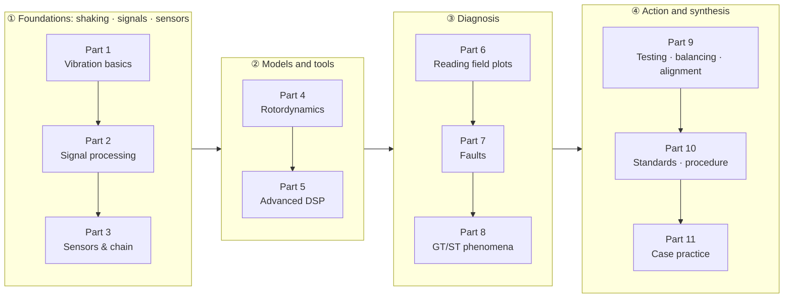

<div align="center">

# Vibration Study · 진동공부

**From a single mass on a spring to diagnosing gas and steam turbines in a power plant.**<br>
A rotating-machinery vibration course where you work the math yourself and get hands-on with the signals

[한국어](README.md) · **English**

[](https://github.com/tg-jang03/Vibration_study/actions/workflows/deploy.yml)


### [→ Open the site](https://tg-jang03.github.io/Vibration_study/) · [→ Signal Lab (all labs)](https://tg-jang03.github.io/Vibration_study/lab/)

> The site itself is written in Korean. Every lab is interactive, so the plots, formulas and numbers still carry most of the story.

</div>

---

## Why this exists

Vibration-diagnosis books tend to fall into one of two camps. Either they are full of equations that never meet a real field plot, or they hand you severity tables without explaining *why* the plot looks that way.
This site bridges the two. Each topic starts from a question such as **"why is there a line right here?"**, builds only the concepts it needs, and lets you check every one of them by moving a slider.

- **One thread from physics to diagnosis.** Mass–spring–damper and modes → signal processing → sensors → rotordynamics → field plots → fault-by-fault diagnosis → GT/ST-specific phenomena.
- **Not just reading.** Every concept has a lab. A guided walkthrough comes before each lab, and an interpretation of what you saw comes after it.
- **Numbers you can trust.** Every calculation is pinned by tests against analytic solutions or published reference values.

## Learning path



| Part | Topic | What you learn | Status |
|:-:|---|---|:-:|
| 1 | Vibration basics | Equilibrium, restoring force and inertia, natural frequency, damping, resonance, modes, unbalance and 1X | ✅ 9 / 9 |
| 2 | Signal processing basics | Fourier, sampling and aliasing, resolution, windows, averaging and TSA, spectrum scaling, modulation | ✅ 9 / 9 |
| 3 | Sensors & measurement chain | Accelerometers, velocity pickups, proximity probes, Keyphasor and phase, measurement pitfalls, protection systems | ✅ 5 / 5 |
| 4 | Rotordynamics basics | Bode and polar plots, Jeffcott rotor, fluid-film bearings and shaft centerline, stability | ✅ 4 / 4 |
| 5 | Advanced signal processing | Filtering and integration, STFT and waterfall, FRF and full spectrum, order tracking, envelope and kurtogram, cepstrum | ✅ 7 / 7 |
| 6 | Reading field plots | Time waveform, waterfall and cascade, orbit, trend and APHT | ✅ 4 / 4 |
| 7 | Fault-by-fault diagnosis | 1X family, misalignment, looseness and rub, fluid-film instability, rolling bearings, gears, electrical, flow-induced, torsional and blade | 🚧 8 / 9 |
| 8 | GT/ST-specific phenomena | Critical-speed passage, thermal bow and the Morton effect, ST and GT specifics, generators and shaft trains | 🚧 4 / 5 |
| 9 – 11 | Action and synthesis | Impact testing, balancing and alignment, ISO 20816 and API essentials, virtual-machine cases | 📝 planned |

<sub>As of 2026-10: 50 of 61 sections published. The full outline is in [docs/Curriculum.md](docs/Curriculum.md) (Korean).</sub>

## Signal Lab

**71 interactive labs** are embedded throughout the text, and each one also has its own page in the [lab gallery](https://tg-jang03.github.io/Vibration_study/lab/).
You build a virtual signal, change the settings, and check against formulas and readouts why the result comes out the way it does. Some of them move.

| Lab | What you try |
|---|---|
| [**LAB-FRC-01** Forced vibration & resonance](https://tg-jang03.github.io/Vibration_study/lab/frc-01/) | Sweep the forcing frequency past the natural frequency. The drawing shows how much farther than its quasi-static position F/k the mass travels, and how far it lags behind. |
| [**LAB-SMP-01** Sampling & aliasing](https://tg-jang03.github.io/Vibration_study/lab/smp-01/) | A strobe-lit spinning disk shows why 940 Hz shows up as 60 Hz, and appears to spin backwards. |
| [**LAB-PHS-01** Phase measurement](https://tg-jang03.github.io/Vibration_study/lab/phs-01/) | The Keyphasor notch passes and gives a pulse; the high spot arrives and gives a peak. The Δt between them *is* the phase. |
| [**LAB-BRG-02** Rolling-bearing faults](https://tg-jang03.github.io/Vibration_study/lab/brg-02/) | A spinning bearing that clicks every time a ball strikes the defect, which explains why BPFO, BPFI, 2×BSF and FTF come out the numbers they do. |
| [**LAB-GEAR-01** Gear faults](https://tg-jang03.github.io/Vibration_study/lab/gear-01/) | A 23/61-tooth pair in mesh: a broken tooth hits once per turn, and a hunting-tooth pair meets once every 2.456 s. |
| [**LAB-FULL-01** Full spectrum](https://tg-jang03.github.io/Vibration_study/lab/full-01/) | Two counter-rotating arrows add up to trace the orbit, and the ±1X bars equal their lengths. |
| [**LAB-ENV-01** Envelope analysis](https://tg-jang03.github.io/Vibration_study/lab/env-01/) | Pick the band where the impacts ring, pull BPFO out of the envelope spectrum, and see what a wrong band does to it. |
| [**LAB-SBX-01** Sandbox](https://tg-jang03.github.io/Vibration_study/lab/sbx-01/) | Pick a machine signal plus F_max, line count, window and averaging, and it tells you which components your setup can actually see. |

## Principles

- **Start from a question.** The text is conversational and uses only concepts from earlier pages. It gives the reason rather than saying "in school it's like this, but in the field…".
- **A figure for every concept.** Figures are SVG drawn from computed values, not AI images, and the numbers inside them are pinned by tests too.
- **Pure functions plus tests.** The calculation modules in `src/lib/` are pure functions with no DOM or React. They work in SI units internally and use seeded random numbers. Every new calculation ships with a test against an analytic solution or a reference value.
- **Rules for moving figures.** 0° is up, rotation is counter-clockwise, and the height of the arrow tip is the signal. Whenever something runs slower than real time, the slow-down ratio stays on screen.
- **Safe for a public repo.** ISO and API standards are summarized with citations, never reproduced. No company field data is used.

## How it is built

A human makes the decisions and AI agents do the implementation.

- **Decision-maker.** The repo owner, a rotating-machinery vibration diagnostics engineer, decides what to learn and what counts as correct.
- **Builders.** [Claude Code](https://claude.com/claude-code) and Codex split the work into tracks and build pages, labs and figures on the same `main` branch.
- **Shared memory.** A single rulebook, [AGENTS.md](AGENTS.md), sits alongside decision records ([Decisions](docs/Decisions.md), `D-xxx`), issues ([Issues](docs/Issues.md), `I-xxx`) and progress notes and handoffs ([Progress](docs/Progress.md)).
- **Checks.** Every push must pass type checking, tests and a build in GitHub Actions before it deploys. A headless browser also checks each page for hydration, console errors and whether the animations actually move.

## Tech stack

| | |
|---|---|
| Site | [Astro 7](https://astro.build) + MDX, static deploy to GitHub Pages |
| Labs | React 19 islands (`client:visible`) |
| Plots & math | Plotly (cartesian), KaTeX |
| Computation | Pure TypeScript functions: FFT, filters, rotor models, fault-signal synthesis |
| Checks | Vitest, `astro check`, headless-Edge page checks, link checks |

## Run it locally

Requires Node.js 22.12 or newer.

```bash
npm install
npm run dev            # http://localhost:4321/Vibration_study/
```

```bash
npm run check          # type check
npm test               # unit tests (Vitest)
npm run build          # static build into dist/
npm run verify:page -- /p3-5/ /lab/   # page checks and captures on a preview server (npx astro preview)
npm run verify:links   # internal link and anchor check after a build
```

<details>
<summary><b>Repository layout</b></summary>

| Path | Contents |
|---|---|
| `src/pages/p{Part}-{section}.mdx` | Course pages |
| `src/pages/lab/[slug].astro` | Standalone lab pages (Signal Lab) |
| `src/components/labs/` | Lab components |
| `src/components/ui/` | Shared lab parts: `LabFrame`, `ParamSlider`, `Plot`, `PolarPlot`, `PhasorView`, `PlayControls` … |
| `src/lib/` | Calculation modules (`dsp`, `mck`, `rotor`, `faults`, `machine` …) and their tests |
| `src/figures/` | SVG figure data for the pages, with tests |
| `docs/` | Curriculum, roadmap, decisions, issues, progress, page-writing guide (Korean) |
| `scripts/verify/` | Page checks (headless Edge), link checks |

</details>

## Docs

[Curriculum](docs/Curriculum.md) · [Roadmap](docs/Roadmap.md) · [Progress](docs/Progress.md) · [Page guide](docs/PageGuide.md) · [Glossary](docs/Glossary.md) · [Working rules](AGENTS.md) · archive in [docs/archive/](docs/archive/). All docs are in Korean.

---

<div align="center"><sub>A personal study site, published openly. If you spot an error, an issue report is very welcome.</sub></div>
