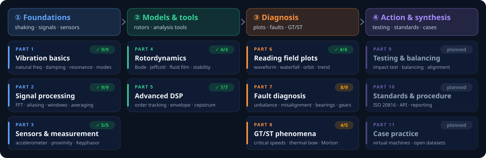

<p align="center">
  
</p>

<p align="center">
  <a href="README.md">한국어</a> · <b>English</b>
</p>

<p align="center">
  <a href="https://github.com/tg-jang03/Vibration_study/actions/workflows/deploy.yml"></a>
  
  
  
  
</p>

<h3 align="center">
  <a href="https://tg-jang03.github.io/Vibration_study/">Open the site</a> &nbsp;·&nbsp;
  <a href="https://tg-jang03.github.io/Vibration_study/lab/">Signal Lab</a> &nbsp;·&nbsp;
  <a href="docs/Curriculum.md">Curriculum</a>
</h3>

<p align="center"><sub>The site is written in Korean. The labs are interactive, though, so the plots, formulas and numbers carry most of the story.</sub></p>

<br>

> Vibration-diagnosis books tend to fall into one of two camps: equations that never meet a real field plot, or severity tables with no word on **why the plot looks that way**.
> This site bridges the two. It starts from a question, builds only the concepts it needs, and lets you check each one with a slider.

<table>
  <tr>
    <td width="33%" valign="top">
      <h3>📐 Physics to diagnosis</h3>
      Mass–spring and modes → DSP → sensors → rotordynamics → field plots → faults → GT/ST. Eleven Parts on one thread.
    </td>
    <td width="33%" valign="top">
      <h3>🎛️ 71 interactive labs</h3>
      Every concept has a lab, with a walkthrough before it and an interpretation after it. Strobed disks, bearings and gears actually spin.
    </td>
    <td width="33%" valign="top">
      <h3>✅ Numbers you can trust</h3>
      Every calculation is pinned by tests against analytic solutions or reference values, down to the numbers inside the figures.
    </td>
  </tr>
</table>

## Learning path

<p align="center">
  
</p>

<p align="center"><sub>As of 2026-10: 50 of 61 sections published. The full outline is in <a href="docs/Curriculum.md">docs/Curriculum.md</a> (Korean).</sub></p>

## Signal Lab: labs you can play with

Build a virtual signal, change the settings, and use the formulas and readouts to see why the result comes out the way it does. Click a picture to open that lab.

<table>
  <tr>
    <td width="50%" valign="top">
      <a href="https://tg-jang03.github.io/Vibration_study/lab/frc-01/"></a>
      <b>LAB-FRC-01 · Forced vibration & resonance</b><br>
      <sub>The dashed box is where the same force would put the mass if applied slowly. At resonance the mass goes 10× farther, a quarter-beat late.</sub>
    </td>
    <td width="50%" valign="top">
      <a href="https://tg-jang03.github.io/Vibration_study/lab/smp-01/"></a>
      <b>LAB-SMP-01 · Sampling & aliasing</b><br>
      <sub>A strobe-lit spinning disk. Why does 940 Hz look like 60 Hz, and turn backwards?</sub>
    </td>
  </tr>
  <tr>
    <td width="50%" valign="top">
      <a href="https://tg-jang03.github.io/Vibration_study/lab/phs-01/"></a>
      <b>LAB-PHS-01 · Keyphasor & phase</b><br>
      <sub>The notch passes and gives a pulse; the high spot arrives and gives a peak. The Δt between them <i>is</i> the phase.</sub>
    </td>
    <td width="50%" valign="top">
      <a href="https://tg-jang03.github.io/Vibration_study/lab/brg-02/"></a>
      <b>LAB-BRG-02 · Rolling-bearing faults</b><br>
      <sub>An impact every time a ball strikes the defect. An inner-race defect moves in and out of the load zone, so it rises and falls at 1X.</sub>
    </td>
  </tr>
  <tr>
    <td width="50%" valign="top">
      <a href="https://tg-jang03.github.io/Vibration_study/lab/gear-01/"></a>
      <b>LAB-GEAR-01 · Gear faults</b><br>
      <sub>A 23/61-tooth pair in mesh. A broken tooth delivers one big impact per turn.</sub>
    </td>
    <td width="50%" valign="top">
      <a href="https://tg-jang03.github.io/Vibration_study/lab/fou-01/"></a>
      <b>LAB-FOU-01 · Building harmonics</b><br>
      <sub>Chain rotating arrows together and the height of the chain's tip traces a square wave.</sub>
    </td>
  </tr>
</table>

<p align="center"><a href="https://tg-jang03.github.io/Vibration_study/lab/"><b>See all 71 labs →</b></a></p>

## Principles

- **Start from a question.** Conversational text that only uses concepts from earlier pages.
- **A figure for every concept.** Each one is SVG drawn from computed values, not an AI image, and the numbers inside it are pinned by tests.
- **Pure functions for the math.** `src/lib/` has no DOM or React. It works in SI units internally and uses seeded random numbers.
- **Rules for moving figures.** 0° is up, rotation is counter-clockwise, and the height of the arrow tip is the signal. When something runs slower than real time, the slow-down ratio stays on screen.
- **Safe for a public repo.** ISO and API standards are summarized with citations, never reproduced. No company field data is used.

## How it is built

> **A human decides; AI agents build.**

The repo owner, a rotating-machinery vibration diagnostics engineer, decides what to learn and what counts as correct. [Claude Code](https://claude.com/claude-code) and Codex split the work into tracks and build pages, labs and figures on the same `main` branch.
They share one rulebook, [AGENTS.md](AGENTS.md), and use decision records ([Decisions](docs/Decisions.md), `D-xxx`), issues ([Issues](docs/Issues.md), `I-xxx`) and handoff notes ([Progress](docs/Progress.md)) as shared memory.
Every push must pass type checking, tests and a build in GitHub Actions before it deploys. A headless browser also checks each page for hydration, console errors and whether the animations actually move.

## Run it locally

```bash
npm install
npm run dev        # http://localhost:4321/Vibration_study/
```

Requires Node.js 22.12 or newer. Other commands: `npm run check` (types) · `npm test` (Vitest) · `npm run build` · `npm run verify:page` (page checks) · `npm run verify:links` (link checks).

<details>
<summary><b>Tech stack · repository layout</b></summary>
<br>

| | |
|---|---|
| Site | [Astro 7](https://astro.build) + MDX, static deploy to GitHub Pages |
| Labs | React 19 islands (`client:visible`) |
| Plots & math | Plotly (cartesian), KaTeX |
| Computation | Pure TypeScript functions: FFT, filters, rotor models, fault-signal synthesis |
| Checks | Vitest, `astro check`, headless-Edge page checks, link checks |

| Path | Contents |
|---|---|
| `src/pages/p{Part}-{section}.mdx` | Course pages |
| `src/pages/lab/[slug].astro` | Standalone lab pages (Signal Lab) |
| `src/components/labs/` · `ui/` | Lab components · shared parts (`LabFrame`, `Plot`, `PhasorView`, `PlayControls` …) |
| `src/lib/` | Calculation modules (`dsp`, `mck`, `rotor`, `faults`, `machine` …) and tests |
| `src/figures/` | SVG figure data for the pages, with tests |
| `docs/` | Curriculum, roadmap, decisions, issues, progress, page guide (Korean) |

</details>

<details>
<summary><b>Docs (Korean)</b></summary>
<br>

[Curriculum](docs/Curriculum.md) · [Roadmap](docs/Roadmap.md) · [Progress](docs/Progress.md) · [Page guide](docs/PageGuide.md) · [Glossary](docs/Glossary.md) · [Working rules](AGENTS.md) · archive in [docs/archive/](docs/archive/)

</details>

<br>

<p align="center"><sub>A personal study site, published openly · If you spot an error, an issue report is very welcome</sub></p>
