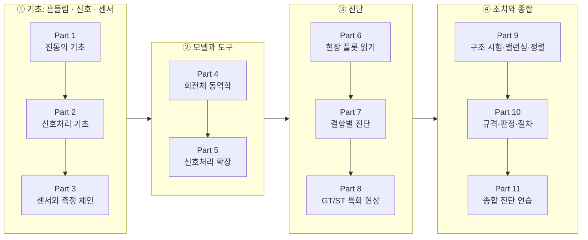

<div align="center">

# 진동공부 · Vibration Study

**질량-스프링 하나에서 출발해, 발전소 가스·증기터빈의 진동을 진단하는 데까지.**<br>
수식은 직접 계산하고, 신호는 직접 만져 보는 회전기계 진동 학습 사이트

**한국어** · [English](README.en.md)

[](https://github.com/tg-jang03/Vibration_study/actions/workflows/deploy.yml)


### [→ 사이트 열기](https://tg-jang03.github.io/Vibration_study/) · [→ Signal Lab (랩 모음)](https://tg-jang03.github.io/Vibration_study/lab/)

</div>

---

## 왜 만드나

진동 진단 책은 대개 둘 중 하나입니다. 식은 많은데 현장 플롯과 이어지지 않거나, 판정표는 있는데 "왜 그렇게 보이나"가 빠져 있거나.
이 사이트는 그 사이를 잇습니다. **"이 줄은 왜 여기 서 있을까?"** 같은 질문에서 출발해, 필요한 개념만 쌓아 올리고, 그 개념을 슬라이더로 직접 바꿔 보며 확인합니다.

- **물리에서 진단까지 한 줄로** — MCK·모드 → 신호처리 → 센서 → 로터다이내믹스 → 현장 플롯 → 결함별 진단 → GT/ST 특화 현상
- **읽기만 하지 않는다** — 개념마다 랩이 있고, 랩 앞에는 따라 하기, 뒤에는 해석이 붙습니다
- **숫자를 믿을 수 있게** — 모든 계산은 해석해·문헌값과 맞춰 보는 테스트로 고정합니다

## 학습 경로



| Part | 주제 | 무엇을 배우나 | 상태 |
|:-:|---|---|:-:|
| 1 | 진동의 기초 | 평형·복원력·관성, 고유진동수, 감쇠, 공진, 모드, 불평형과 1X | ✅ 9 / 9 |
| 2 | 신호처리 기초 | 푸리에, 샘플링·에일리어싱, 분해능, 윈도우, 평균화·TSA, 스케일링, 변조 | ✅ 9 / 9 |
| 3 | 센서와 측정 체인 | 가속도계·속도계·프록시미티 프로브, 키페이저와 위상, 측정 함정, 보호 시스템 | ✅ 5 / 5 |
| 4 | 회전체 동역학 | Bode·Polar, Jeffcott 로터, 유막 베어링과 Shaft centerline, 안정성 | ✅ 4 / 4 |
| 5 | 신호처리 확장 | 필터·적분, STFT·워터폴, FRF·Full spectrum, 차수추적, 엔벨로프·Kurtogram, 켑스트럼 | ✅ 7 / 7 |
| 6 | 현장 플롯 읽기 | 시간파형, Waterfall·Cascade, 오빗, 트렌드·APHT | ✅ 4 / 4 |
| 7 | 결함별 진단 | 1X 계열, 미스얼라인·풀림·러브, 유체막 불안정, 베어링, 기어, 전기, 유체, 비틀림·블레이드 | 🚧 8 / 9 |
| 8 | GT/ST 특화 현상 | 임계속도 통과, 열 휨·Morton effect, ST·GT 특화, 발전기와 축계 | 🚧 4 / 5 |
| 9 – 11 | 조치와 종합 | 임팩트 시험·밸런싱·정렬, ISO 20816·API 요점, 가상 기계 케이스 | 📝 계획 |

<sub>2026-10 기준 · 61절 중 50절 공개 · 상세 목차는 [docs/Curriculum.md](docs/Curriculum.md)</sub>

## Signal Lab

**71개의 인터랙티브 랩**이 본문 곳곳에 들어 있고, [랩 모음](https://tg-jang03.github.io/Vibration_study/lab/)에서 하나씩 따로 열 수도 있습니다.
가상 신호를 만들고, 설정을 바꾸고, 결과가 왜 그렇게 나오는지 식과 읽음값으로 확인합니다. 몇 가지는 직접 움직입니다.

| 랩 | 해 보는 것 |
|---|---|
| [**LAB-FRC-01** 강제진동과 공진](https://tg-jang03.github.io/Vibration_study/lab/frc-01/) | 가진 주파수를 고유진동수 둘레로 옮기면, 질량이 "같은 힘을 천천히 걸었을 때의 자리"보다 몇 배 멀리, 얼마나 늦게 따라가는지가 그림에서 보인다 |
| [**LAB-SMP-01** 샘플링과 에일리어싱](https://tg-jang03.github.io/Vibration_study/lab/smp-01/) | 스트로브로 찍은 회전 원판 — 940 Hz가 왜 60 Hz로, 그것도 거꾸로 도는 것처럼 보이는가 |
| [**LAB-PHS-01** 위상 측정](https://tg-jang03.github.io/Vibration_study/lab/phs-01/) | 키페이저 홈이 지나면 펄스, high spot이 오면 봉우리 — 그 사이 Δt가 곧 위상 |
| [**LAB-BRG-02** 구름베어링 결함](https://tg-jang03.github.io/Vibration_study/lab/brg-02/) | 도는 베어링에서 볼이 결함을 칠 때마다 충격 — BPFO·BPFI·2×BSF·FTF가 왜 그 숫자인가 |
| [**LAB-GEAR-01** 기어 결함](https://tg-jang03.github.io/Vibration_study/lab/gear-01/) | 맞물려 도는 23·61이빨 기어, 깨진 이는 한 바퀴에 한 번, 헌팅 투스는 2.456 s에 한 번 |
| [**LAB-FULL-01** Full spectrum](https://tg-jang03.github.io/Vibration_study/lab/full-01/) | 반대로 도는 두 화살표의 합이 오빗을 그린다 — ±1X 막대 = 화살표 길이 |
| [**LAB-ENV-01** 엔벨로프 분석](https://tg-jang03.github.io/Vibration_study/lab/env-01/) | 충격이 울리는 대역을 골라 포락선 스펙트럼에서 BPFO를 꺼내고, 틀린 대역이 무엇을 망치는지 본다 |
| [**LAB-SBX-01** 샌드박스](https://tg-jang03.github.io/Vibration_study/lab/sbx-01/) | 기계 신호와 F_max·라인 수·윈도우·평균을 정하면, 성분마다 지금 설정으로 보이는지 판정해 준다 |

## 만드는 원칙

- **질문에서 출발한다** — 구어체로, 앞 페이지에서 배운 개념만 써서 설명합니다. "학교에선 이렇지만 현장에선…" 같은 말 대신 이유를 씁니다.
- **개념마다 그림** — 그림은 AI 이미지가 아니라 계산값으로 직접 그린 SVG입니다. 그림 속 숫자도 테스트로 고정합니다.
- **계산은 순수 함수 + 테스트** — `src/lib/`의 계산 모듈은 DOM·React와 무관한 순수 함수이고, 내부 단위는 SI, 난수는 시드 고정. 새 계산에는 해석해나 문헌값과 맞추는 테스트가 붙습니다.
- **움직이는 그림의 약속** — 0°는 위, 회전은 반시계, 화살표 끝의 높이가 신호. 실제보다 느리게 돌릴 때는 배율을 늘 보여 줍니다.
- **공개 저장소답게** — ISO·API 규격 본문과 표는 옮기지 않고 요약과 출처만 적습니다. 회사 현장 데이터는 쓰지 않습니다.

## 어떻게 만들어지나

결정은 사람이, 구현은 AI 에이전트가 합니다.

- **결정권자** — 저장소 주인(회전기계 진동 진단 엔지니어)이 무엇을 배울지, 무엇이 맞는지를 정합니다
- **작업자** — [Claude Code](https://claude.com/claude-code)와 Codex가 트랙을 나눠 같은 `main`에서 페이지·랩·그림을 만듭니다
- **공유 기억** — 공통 규칙은 [AGENTS.md](AGENTS.md) 하나, 결정은 [Decisions](docs/Decisions.md)(`D-xxx`), 이슈는 [Issues](docs/Issues.md)(`I-xxx`), 진행과 인수인계는 [Progress](docs/Progress.md)에 남깁니다
- **검사** — push마다 GitHub Actions가 타입 검사·테스트·빌드를 통과해야 배포합니다. 화면은 헤드리스 브라우저로 hydration·콘솔 오류·움직임까지 점검합니다

## 기술 스택

| | |
|---|---|
| 사이트 | [Astro 7](https://astro.build) + MDX, GitHub Pages 정적 배포 |
| 랩 | React 19 아일랜드 (`client:visible`) |
| 플롯 · 수식 | Plotly (cartesian), KaTeX |
| 계산 | TypeScript 순수 함수 — FFT·필터·로터 모델·결함 신호 합성 |
| 검사 | Vitest, `astro check`, 헤드리스 Edge 페이지 점검, 링크 점검 |

## 직접 돌려 보기

Node.js 22.12 이상이 필요합니다.

```bash
npm install
npm run dev            # http://localhost:4321/Vibration_study/
```

```bash
npm run check          # 타입 검사
npm test               # 단위 테스트 (Vitest)
npm run build          # dist/ 정적 빌드
npm run verify:page -- /p3-5/ /lab/   # 미리보기 서버(npx astro preview) 위에서 페이지 점검·캡처
npm run verify:links   # 빌드 후 사이트 안 링크·앵커 점검
```

<details>
<summary><b>폴더 구성</b></summary>

| 경로 | 내용 |
|---|---|
| `src/pages/p{Part}-{절}.mdx` | 본문 페이지 |
| `src/pages/lab/[slug].astro` | 랩 단독 페이지 (Signal Lab) |
| `src/components/labs/` | 랩 컴포넌트 |
| `src/components/ui/` | 랩 공용 부품 — `LabFrame`, `ParamSlider`, `Plot`, `PolarPlot`, `PhasorView`, `PlayControls` … |
| `src/lib/` | 계산 모듈 (`dsp`, `mck`, `rotor`, `faults`, `machine` …)과 테스트 |
| `src/figures/` | 본문 SVG 그림 데이터와 테스트 |
| `docs/` | 커리큘럼 · 로드맵 · 결정 · 이슈 · 진행 · 페이지 작성 지침 |
| `scripts/verify/` | 페이지 점검(헤드리스 Edge), 링크 점검 |

</details>

## 문서

[커리큘럼](docs/Curriculum.md) · [로드맵](docs/Roadmap.md) · [진행 상황](docs/Progress.md) · [페이지 작성 지침](docs/PageGuide.md) · [용어집](docs/Glossary.md) · [작업 규칙](AGENTS.md) · 끝난 기록은 [docs/archive/](docs/archive/)

---

<div align="center"><sub>개인 학습용 공개 사이트입니다. 내용의 오류는 이슈로 알려 주시면 고맙겠습니다.</sub></div>
