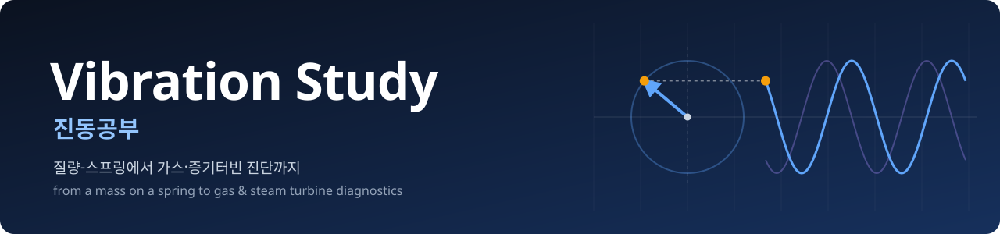
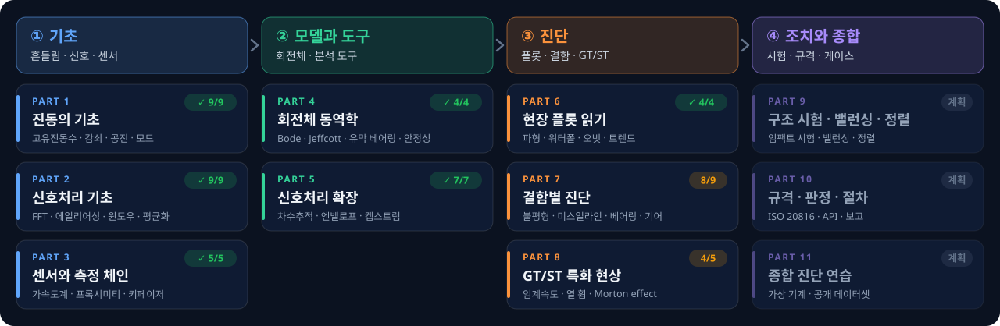
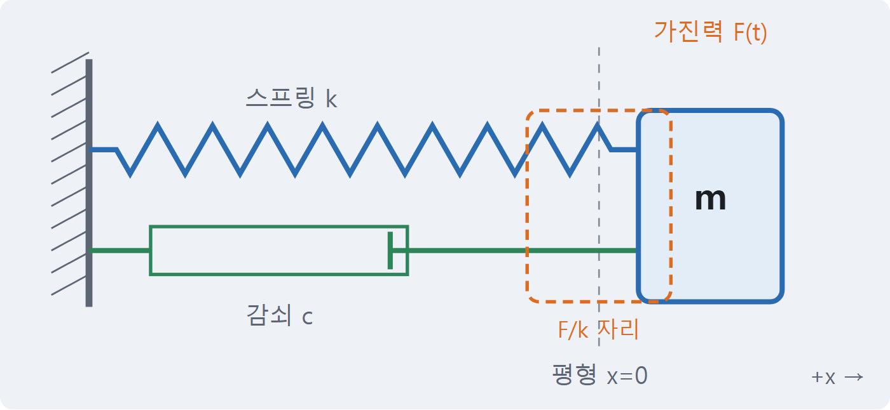
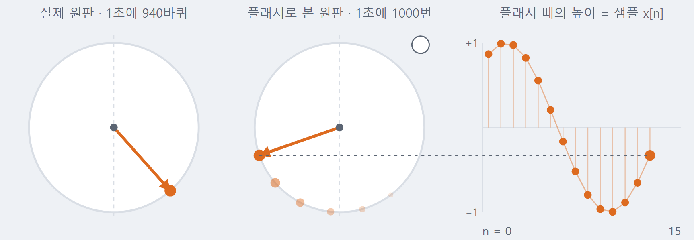
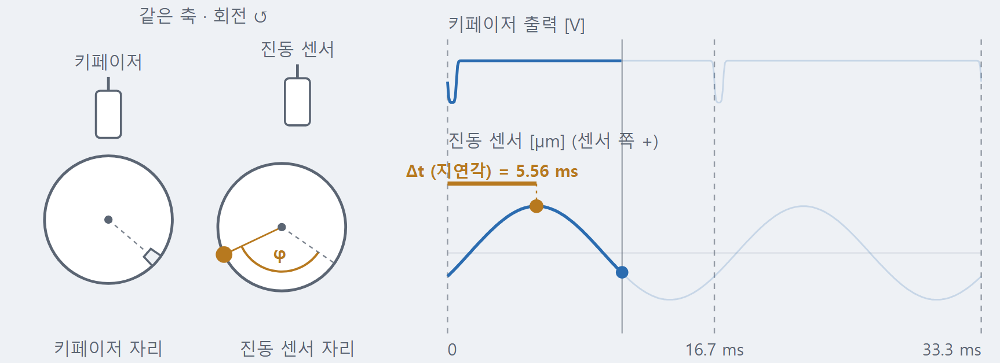
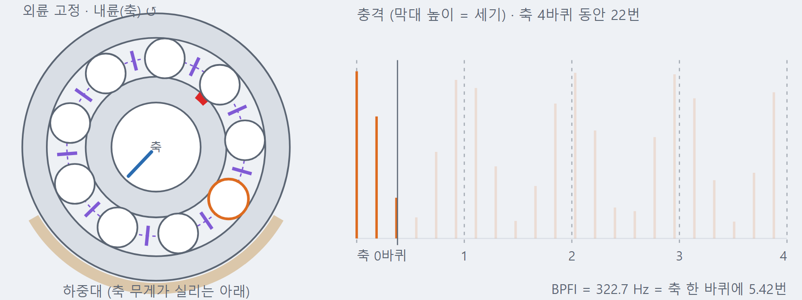
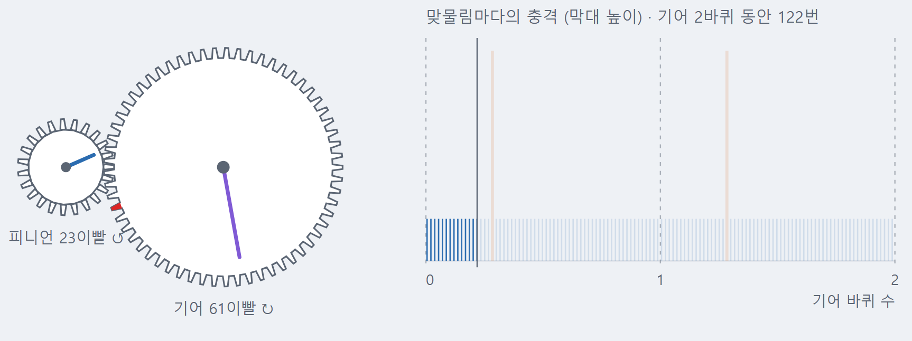
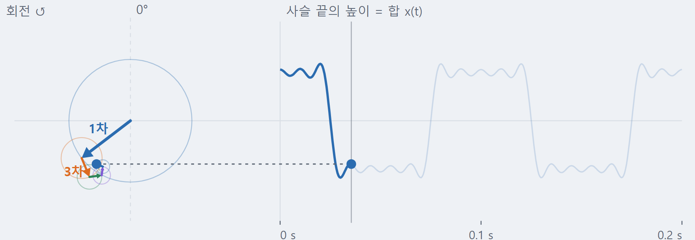

<p align="center">
  
</p>

<p align="center">
  <b>한국어</b> · <a href="README.en.md">English</a>
</p>

<p align="center">
  <a href="https://github.com/tg-jang03/Vibration_study/actions/workflows/deploy.yml"></a>
  
  
  
  
</p>

<h3 align="center">
  <a href="https://tg-jang03.github.io/Vibration_study/">사이트 열기</a> &nbsp;·&nbsp;
  <a href="https://tg-jang03.github.io/Vibration_study/lab/">Signal Lab</a> &nbsp;·&nbsp;
  <a href="docs/Curriculum.md">커리큘럼</a>
</h3>

<br>

> 진동 진단 책은 식만 많아 현장 플롯과 안 이어지거나, 판정표만 있고 **"왜 그렇게 보이나"** 가 빠져 있습니다.
> 이 사이트는 그 사이를 잇습니다 — 질문에서 출발해, 필요한 개념만 쌓고, 슬라이더로 직접 확인합니다.

<table>
  <tr>
    <td width="33%" valign="top">
      <h3>📐 물리에서 진단까지</h3>
      MCK·모드 → 신호처리 → 센서 → 로터다이내믹스 → 현장 플롯 → 결함 → GT/ST. 한 줄로 이어지는 11개 Part.
    </td>
    <td width="33%" valign="top">
      <h3>🎛️ 71개의 인터랙티브 랩</h3>
      개념마다 랩이 있고, 앞에는 따라 하기, 뒤에는 해석. 회전 원판·베어링·기어가 실제로 돕니다.
    </td>
    <td width="33%" valign="top">
      <h3>✅ 믿을 수 있는 숫자</h3>
      모든 계산은 해석해·문헌값과 맞춰 보는 테스트로 고정. 그림 속 숫자까지 검사합니다.
    </td>
  </tr>
</table>

## 학습 경로

<p align="center">
  
</p>

<p align="center"><sub>2026-10 기준 · 61절 중 50절 공개 · 자세한 목차는 <a href="docs/Curriculum.md">docs/Curriculum.md</a></sub></p>

## Signal Lab — 직접 움직여 보는 랩

가상 신호를 만들고, 설정을 바꾸고, 결과가 왜 그렇게 나오는지 식과 읽음값으로 확인합니다. 그림을 누르면 그 랩이 열립니다.

<table>
  <tr>
    <td width="50%" valign="top">
      <a href="https://tg-jang03.github.io/Vibration_study/lab/frc-01/"></a>
      <b>LAB-FRC-01 · 강제진동과 공진</b><br>
      <sub>점선 상자는 같은 힘을 천천히 걸었을 때의 자리. 공진에서 질량은 그보다 10배 멀리, 1/4 박자 늦게 갑니다.</sub>
    </td>
    <td width="50%" valign="top">
      <a href="https://tg-jang03.github.io/Vibration_study/lab/smp-01/"></a>
      <b>LAB-SMP-01 · 샘플링과 에일리어싱</b><br>
      <sub>스트로브로 본 회전 원판. 940 Hz가 왜 60 Hz로, 그것도 거꾸로 도는 것처럼 보일까요?</sub>
    </td>
  </tr>
  <tr>
    <td width="50%" valign="top">
      <a href="https://tg-jang03.github.io/Vibration_study/lab/phs-01/"></a>
      <b>LAB-PHS-01 · 키페이저와 위상</b><br>
      <sub>홈이 지나면 펄스, high spot이 오면 봉우리. 그 사이 Δt가 곧 위상입니다.</sub>
    </td>
    <td width="50%" valign="top">
      <a href="https://tg-jang03.github.io/Vibration_study/lab/brg-02/"></a>
      <b>LAB-BRG-02 · 구름베어링 결함</b><br>
      <sub>볼이 결함을 칠 때마다 충격. 내륜 결함은 하중대를 들락날락해 1X로 오르내립니다.</sub>
    </td>
  </tr>
  <tr>
    <td width="50%" valign="top">
      <a href="https://tg-jang03.github.io/Vibration_study/lab/gear-01/"></a>
      <b>LAB-GEAR-01 · 기어 결함</b><br>
      <sub>맞물려 도는 23·61이빨 기어. 깨진 이는 한 바퀴에 한 번 큰 충격을 냅니다.</sub>
    </td>
    <td width="50%" valign="top">
      <a href="https://tg-jang03.github.io/Vibration_study/lab/fou-01/"></a>
      <b>LAB-FOU-01 · 하모닉 쌓기</b><br>
      <sub>도는 화살표를 이어 붙이면, 사슬 끝의 높이가 사각파를 그립니다.</sub>
    </td>
  </tr>
</table>

<p align="center"><a href="https://tg-jang03.github.io/Vibration_study/lab/"><b>랩 71개 모두 보기 →</b></a></p>

## 만드는 원칙

- **질문에서 출발** — 구어체로, 앞 페이지에서 배운 개념만 써서 설명합니다.
- **개념마다 그림** — AI 이미지가 아니라 계산값으로 직접 그린 SVG. 그림 속 숫자도 테스트로 고정합니다.
- **계산은 순수 함수** — `src/lib/`는 DOM·React와 무관한 순수 함수, 내부 단위 SI, 난수는 시드 고정.
- **움직이는 그림의 약속** — 0°는 위, 회전은 반시계, 화살표 끝의 높이가 신호. 느리게 돌릴 땐 배율을 늘 보여 줍니다.
- **공개 저장소답게** — ISO·API 규격 본문은 옮기지 않고 요약과 출처만. 회사 현장 데이터는 쓰지 않습니다.

## 어떻게 만들어지나

> **결정은 사람이, 구현은 AI 에이전트가.**

저장소 주인(회전기계 진동 진단 엔지니어)이 무엇을 배울지, 무엇이 맞는지를 정하고, [Claude Code](https://claude.com/claude-code)와 Codex가 트랙을 나눠 같은 `main`에서 페이지·랩·그림을 만듭니다.
규칙은 [AGENTS.md](AGENTS.md) 하나, 결정은 [Decisions](docs/Decisions.md)(`D-xxx`), 이슈는 [Issues](docs/Issues.md)(`I-xxx`), 인수인계는 [Progress](docs/Progress.md)에 남겨 서로의 기억으로 씁니다.
push마다 GitHub Actions가 타입 검사·테스트·빌드를 통과해야 배포되고, 헤드리스 브라우저가 화면의 hydration·콘솔 오류·움직임까지 점검합니다.

## 직접 돌려 보기

```bash
npm install
npm run dev        # http://localhost:4321/Vibration_study/
```

Node.js 22.12 이상이 필요합니다. 그 밖의 명령은 `npm run check`(타입) · `npm test`(Vitest) · `npm run build` · `npm run verify:page`(페이지 점검) · `npm run verify:links`(링크 점검).

<details>
<summary><b>기술 스택 · 폴더 구성</b></summary>
<br>

| | |
|---|---|
| 사이트 | [Astro 7](https://astro.build) + MDX, GitHub Pages 정적 배포 |
| 랩 | React 19 아일랜드 (`client:visible`) |
| 플롯 · 수식 | Plotly (cartesian), KaTeX |
| 계산 | TypeScript 순수 함수 — FFT·필터·로터 모델·결함 신호 합성 |
| 검사 | Vitest, `astro check`, 헤드리스 Edge 페이지 점검, 링크 점검 |

| 경로 | 내용 |
|---|---|
| `src/pages/p{Part}-{절}.mdx` | 본문 페이지 |
| `src/pages/lab/[slug].astro` | 랩 단독 페이지 (Signal Lab) |
| `src/components/labs/` · `ui/` | 랩 컴포넌트 · 공용 부품 (`LabFrame`, `Plot`, `PhasorView`, `PlayControls` …) |
| `src/lib/` | 계산 모듈 (`dsp`, `mck`, `rotor`, `faults`, `machine` …)과 테스트 |
| `src/figures/` | 본문 SVG 그림 데이터와 테스트 |
| `docs/` | 커리큘럼 · 로드맵 · 결정 · 이슈 · 진행 · 페이지 작성 지침 |

</details>

<details>
<summary><b>문서</b></summary>
<br>

[커리큘럼](docs/Curriculum.md) · [로드맵](docs/Roadmap.md) · [진행 상황](docs/Progress.md) · [페이지 작성 지침](docs/PageGuide.md) · [용어집](docs/Glossary.md) · [작업 규칙](AGENTS.md) · 끝난 기록은 [docs/archive/](docs/archive/)

</details>

<br>

<p align="center"><sub>개인 학습용 공개 사이트입니다 · 내용의 오류는 이슈로 알려 주시면 고맙겠습니다</sub></p>
